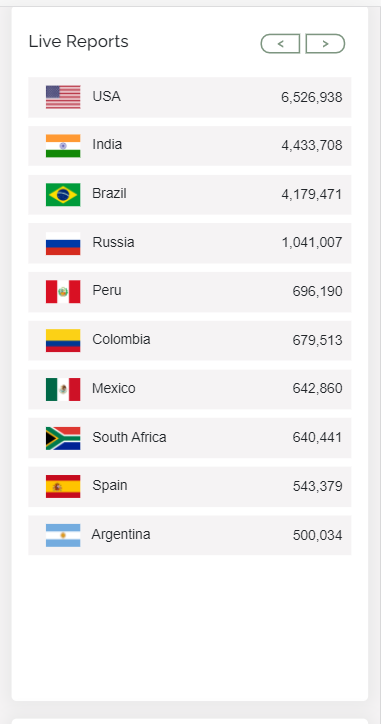

# Covid-19-Tracker

## Purpose

An app to help you track the current covid-19 related data.

## Description

Is web-application built to help tracking covid-19 datas for every single nation.It fetches data from Worldometers and Johns Hopkins University that their data gets updated every 10 minutes.This application will give you a clear understanding of a country's current state regarding new cases,recovered,death and total tests made so far.In addition to this it will present you covid related news from all media sources that will help you understand what progress have been done in relation to corona virus.
User has the ability to search for any country in the world or track the live -report section sorted from the most affected to the least affected countries.

## Built With

- HTML
- CSS
- BOOTSTRAP
- JAVASCRIPT
- OpenWeather-Api
- Google-map-Api
- Coronanews-Api (https://coronews.iamharsh.dev/)
- Disease-corona - (https://disease.sh/docs/#/COVID-19%3A%20Worldometers)

## Website

https://rongbangye.github.io/Covid-19-Tracker/

## Visuals

fully responive in all media-screen sizes;

# <h2 class="text-center" style="color:blue;">EXTRA LARGE SCREEN SIZE</h2>

# LARGE SCREEN SIZE

# MEDIUM SCREEN SIZE

# SMALL SCREEN SIZE

# EXTRA-SMALL SCREEN SIZE

## Contribution

Made by solomon & Rongbang (Bryan)

### ©️2020 Covid-Tracker
